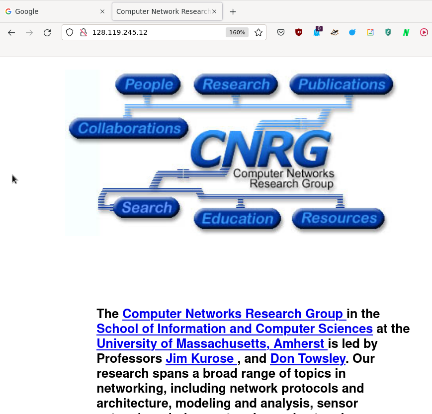
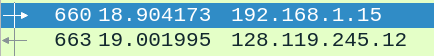

# Compte-rendu TD1

> Remarque : je rédige ce compte-rendu comme si c'était un vrai document à rendre. Généralement, dès que vous faites du Wireshark, c'est toujours bien de mettre des screenshots d'éléments qui nous intéressent.
> 
> A noter que le fichier capture_td.pcapng est le Wireshark que j'ai enregistré sur un PC à moi. Vous pouvez donc le ré-ouvrir et vous aurez exactement le même résultat que moi.

## Question 1

En ouvrant un navigateur web à l'adresse indiquée, on obtient une page avec un simple texte :


## Question 2

Le filtre présent au-dessus de la question nous permet de filtrer toutes les requêtes HTTP de ou vers l'adresse IP qui nous intéresse :

```lua
(ip.dst == 128.119.245.12 || ip.src == 128.119.245.12) && http
```

On en déduit facilement le filtre qui ne garde que la destination et les requêtes HTTP :

```lua
ip.dst == 128.119.245.12 && http
```


Dans Wireshark, cela nous donne uniquement 3 paquets qui sont bien en HTTP et dont l'adresse destination (colonne `Destination`) est celle indiquée dans la question.

## Question 3

Avec le filtre activé, on comprend que le premier paquet (#660) est la requête de mon PC vers le site de la fac américaine ("je veux récupérer la page `/wireshark-labs/INTRO-wireshark-file1.html`"). La fenêtre inférieure de Wireshark nous donne des informations sur les différents protocoles utilisés dans ce paquet :


La source étant mon ordinateur, on peut en déduire les valeurs de l'adresse IP et l'adresse MAC qu'on retrouve sous Windows avec la commande `ipconfig /all` :


- Adresse IP : 192.168.1.15

- Adresse MAC : 40-9F-38-51-1B-7B

## Question 4

Dans la capture, la première requête GET va de mon PC vers la fac américaine. On en déduit facilement son adresse IP : 128.119.245.12 (qui était d'ailleurs déjà donnée à la question 2). Pour vérifier, si on tape cette adresse IP dans le navigateur, on obtient la page d'accueil du laboratoire de recherche qui a construit la page indiquée à la question 1 :



## Question 5

D'après le screenshot de la question 3, on voit les différents protocoles organisés sous forme de couche, comme dans le modèle OSI (cf fin du premier cours). Chaque protocole correspond à une couche du modèle OSI :

- Ethernet

- IPv4

- TCP

- HTTP

## Question 6

Le temps est indiqué dans la deuxième colonne :



On voit qu'il y a environ 0,1 seconde entre la requête et la réponse. Pour obtenir le temps exact, on peut ajouter une colonne par le menu `Edit => Preferences` et utiliser le paramètre `Delta time displayed`. 


Le temps exact est donc de 0,097822 secondes.
