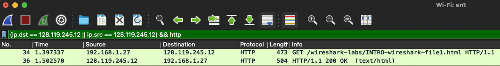
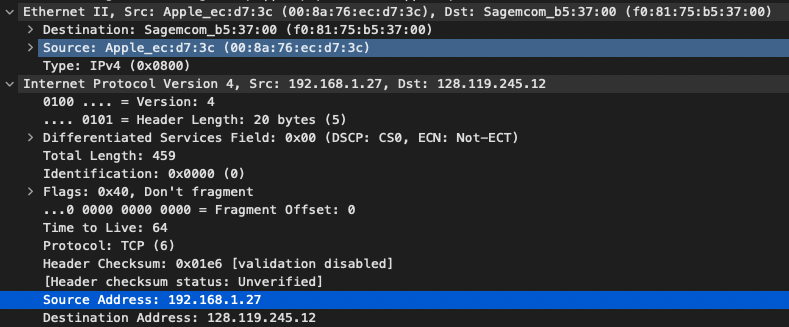
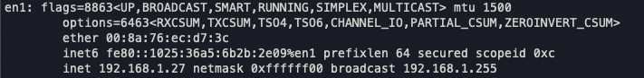
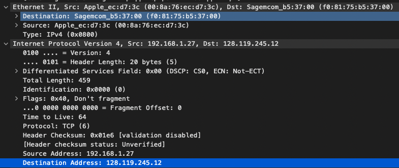
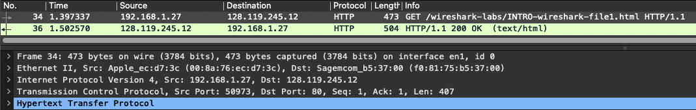
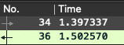

# TD1 

## Question 2:

Le filtre à utiliser est ```(ip.dst == 128.119.245.12 || ip.src == 128.119.245.12) && http```, ce qui nous donne le résultat suivant :




## Question 3:

Mon @ip est *128.168.1.27* et mon @mac *00:8a:76:ec:d7:3c*



Vérification avec ```ifconfig``` :




## Question 4:

L'adresse ip du serveur est *128.119.245.12* et son @mac *f0:81:75:b5:37:00* 




## Question 5: 

Les protocoles Ethernet, IPV4, TCP et HTTP sont utilisés 




## Question 6: 



*1.502570 - 1.397337 = 0,105233*

Soit 0,105233 seconde c'est écoulé entre la requette et le serveur


