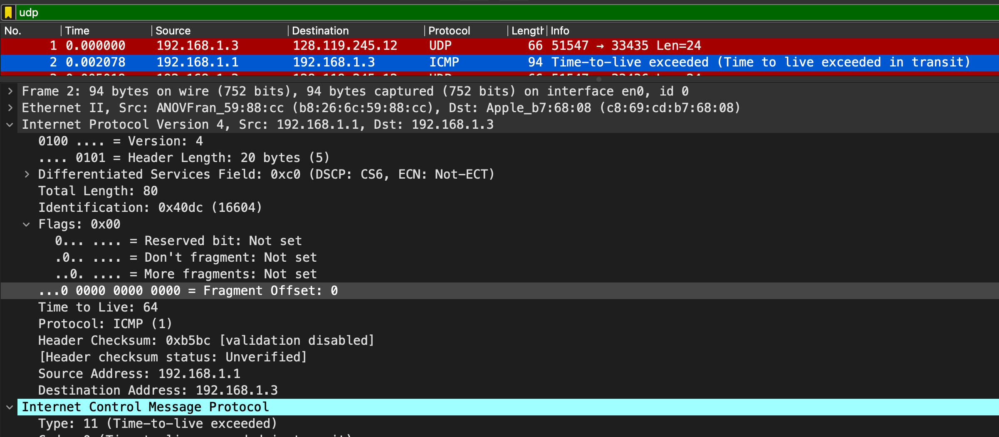

# TD noté

## Excercice 1
#

### Question 1
Dans le fichier machine3.pcapng, quel est le protocole utilisé au dessus de la couche IP dans le paquet #50 ? À quoi sert ce protocole ?

> Il s'agit du protocole ICMP, celui-ci permet de transmettre des messages de contrôle et d’erreur.
>
> 

### Question 2 
Comment le destinataire de ce paquet peut-il déterminer le protocole de la couche réseau utilisé dans ce paquet, pour pouvoir le décoder ? Comment peut-il identifer le protocole utilisé au dessus d'IP ?

> Avec le type et le subtype comme pour le Wifi ?

### Question 3
Qui est l'émetteur de ce paquet ? Quelle est son adresse IP ? Quelle est son adresse MAC ?
> - Emetteur : *ActionSt_2b:b5:0f*
> - @IP : *192.168.10.3*
> - @MAC : *00:24:9b:2b:b5:0f*
>
> 

### Question 4
Quel est le message contenu dans ce paquet ? À quoi sert-il ?
> L'objectif de ce paquet est de pinger la machine de destination.
>
> 

### Question 5
Qui est le destinataire de ce paquet ? Quelle est son adresse IP ?
> - Destinataire : *ActionSt_2b:b5:11*
> - @IP : *192.168.10.2*
>
> *Voir img question 3*

### Question 6
Quelle est l'adresse MAC de destination de ce paquet ? Correspond-elle au destinataire final de ce paquet ? Pourquoi ?

> - @MAC : *00:24:9b:2b:b5:11*
> 
> @MAC correspond au destinataire, ce qui semble normal. De plus on peut voir ci dessous que la machine à répondu à la #51
> 
> 

### Question 7
Comment l'émetteur de ce paquet a-t-il pu déterminer l'adresse MAC du destinataire ? Ex- pliquez le mécanisme à partir des échanges que vous pouvez observer dans la trace.

> #48 on remarque le protocole ARP avec comme info `Who has 192.168.10.2 Tell 192.168.10.3`, on peut ensuite voir l'@MAC de `192.168.10.2` un peu plus bas.
> 
> On peut alors supposer que `192.168.10.3` connait l'@MAC de `192.168.10.2` grâce à la réponse au #49
> 
> 
>
> C'est un message mis sur le Broadcast, on peut également constater qu'il c'est passé la même chose pour `192.168.10.1` au #39 et #'à 

### Question 8 
Quel paquet contient la réponse au message contenu dans le paquet #50 ?
> C'est le #51
>
> *Voir img question 6*

### Question 9
Ouvrez maintenant le fichier machine2.pcapng. Quels sont les numéros des paquets correspondant aux messages identifiés dans les questions précédentes? Est-ce que ces paquets sont identiques aux précédents (ont-il les mêmes adresses IP et MAC, source et destination) ? Pourquoi ?

> Pour le ping request c'est le paquet #31 et #32(reply)
>
> Pour la découvert d'@MAC, il s'agit du #29 et #30(reply)
>
>
> 
> - Emetteur : *ActionSt_2b:b5:0f*
>   - @IP : *192.168.10.3*
>   - @MAC : *00:24:9b:2b:b5:0f*
>
> - Destinataire : *ActionSt_2b:b5:11*
>   - @IP : *192.168.10.2*
>   - @MAC : *00:24:9b:2b:b5:11*
>
> Il s'agit donc des même informations, ce qui est logique c'est la capture du même paquet mais sur une machine différente. L'information reste donc la même.

### Question 10
Question 10. Ces paquets ont-il été envoyés au routeur ? Pourquoi ?
> Il y a un switch, l'objectif est donc d'envoyer l'information seulement aux appareils qui en ont besoin. Le routeur n'a pas reçus les paquets

## Excercice 2
#

### Question 11
Quel est le protocole applicatif utilisé par le paquet #78 ? À quoi sert-il ? 
> Il s'agit du HTTP, utilisé pour la communication entre des services web.
>
> 

### Question 12
Quel est l'émetteur de ce paquet (quelle est son adresse IP) ? Quel est le destinataire (quelle est son adresse IP) ?
>
> 
> - Emetteur : *ActionSt_2b:b5:0f*
>   - @IP : *192.168.10.3*
>   - @MAC : *00:24:9b:2b:b5:0f*

### Question 13
Quelle est l'adresse MAC destination de ce paquet ? Correspond-elle au destinataire final ? Pourquoi ?
> *Voir img question 12*
>
> - Destinataire : *Cisco_8f:da:92*
>   - @IP : *74.125.193.94*
>   - @MAC : *00:1f:6c:8f:da:92*
>
> C'est le destinataire final, on retrouve une réponse à la #96
>
> 

### Question 14
Comment l'émetteur de ce paquet a-t-il pu déterminer l'adresse MAC de destination ?
> La machine 3 à intéroger sont routeur avec le DNS *www.google.com* pour obtenir en retour l'@IP et l'@MAC du serveur google.
>   - @IP : *74.125.193.94*
>   - @MAC : *00:1f:6c:8f:da:92*
>
> 

### Question 15
Ce paquet a-t-il été envoyé au routeur ? Pourquoi ?
> Ce paquet à bien été envoyé au routeur, pour que celui ci puisse faire le lien vers le serveur de google.com.

### Question 16
Quel est le message contenu dans ce paquet ? À quoi sert-il ?
> Il s'agit d'une requette *GET HTTP*, c'est une requette pour demander au serveur web une ressource, comme une page HTML.
>
> *Voir img question 11*

### Question 17
Quel est le nom de domaine du destinataire de ce message ?
> Le nom de domaine du destinataire est *google.com*
>
> *Voir img question 13*

### Question 18
En observant les paquets 71 à 74, expliquez comment l'émetteur a pu trouver l'adresse IP
> En utilisant une requette avec le protocole DNS, la machine 3 à intéroger le routeur pour obtenir l'@IPv4 et l'@IPv6 (DNS A &rarr; @IPv4 et DNS AAAA &rarr; @IPv6)
>
> 

### Question 19 
Quelle est la réponse à ce message ? Dans quel paquet est-elle transmise ?
> *Voir img question 18*
>
> #71 demande @IPv4 &rarr; #73 réponse @IPv4
>
> 
>
> #72 demande @IPv6 &rarr; #74 réponse @IPv6
>
> 

## Exercice 3 - Traceroute
#

### Question 20
Filtrez la trace pour ne faire apparaître que les messages UDP. Identifiez le premier paquet UDP échangé. Quelle est son adresse IP source ? Quelle est son adresse IP destination ?
>
> 
> - @IP Destination : *128.119.245.12*
> - @IP Source : *192.168.10.3*

### Question 21
À l'aide du site https://www.ip-tracker.org/ ou d'un outil similaire, déterminez à qui appartient cette adresse IP. Dans quel pays est située la machine possédant cette adresse IP ? Quel est son nom de domaine ?
>
> 
> - @IP: *128.119.245.12*
> - DNS: [gaia.cs.umass.edu](gaia.cs.umass.edu)
> - Pays: uS

### Question 22
Observez les champs de l'en-tête IP du premier paquet UDP. Quelle est la valeur du champ TTL ? À quoi correspond ce champ et à quoi sert-il ? Que risque-t-il de se produire pour ce paquet ?
>
> 
> Correspond au temp au qu'elle l'information doit être conservé *(Time To Live)*.
>
> Quand le temps sera écoulé alors l'information sera supprimé, s'il n'a pas été lu alors l'information sera perdu.

### Question 23
Comment évolue le champ TTL entre les paquets UDP successifs (vous devez analyser au moins les 7 premiers paquets) ?
>
> 
> Le champ TTL est incrémenté de 1 par 1 

### Question 24
Supprimez maintenant le filtre d'affichage afin de faire apparaître de nouveau les messages ICMP. Identifiez le premier message ICMP (paquet #2). De quel type de message ICMP s'agit-il? Quel est l'émetteur de ce paquet ? De qui s'agit-il ?
>
> 
> C'est un message ICMP pour dire que le champ TTL du #1 à été dépassé
>
> L'émetteur est `192.168.1.1`, soit le routeur pour avertir `192.168.1.3` 

### Question 25
Qui sont les différents émetteurs des messages ICMP suivants ?
> On trouve :
> 
> - `192.168.1.1`
> - `80.10.237.121`
> - `193.253.150.130`
> - `193.252.159.158`
> - ...
>
> 
>
> 

### Question 26 
Pourquoi n'y a-t-il plus de messages ICMP entre les paquets UDP #49 et 52 ?
> 
>
> Puisque le champ TTL est plus important que les précedent, donc le Time to Live n'est pas encore atteint.

### Question 27
Comment évolue le temps entre les messages UDP et les messages ICMP correspondant ? Que se passe-t-il entre les messages 48 et 53 ?
> De manière plus lente que les autres, en tout 16 secondes c'est écoulé contre même pas une seconde entre les autres. C'est dû au champ TTL qui est plus important que les autres
>
> 

