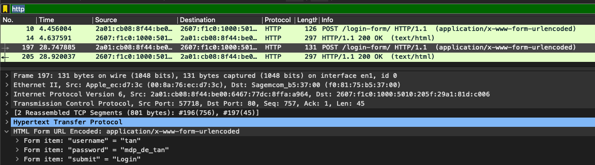
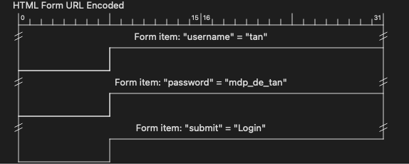

## Problème

Avec Wireshark, montrer comment on peut récupérer les informations d'identification dans une page HTTP simple.

[Login Form](http://www.demo.amitjakhu.com/login-form/)

> Il suffit d'utiliser le filtre *http* puis de trouver la bonne trame :
> 
> 
>
> On peut également utiliser la table :
> 
> 

## Références

- La RFC du protocole HTTP : https://tools.ietf.org/html/rfc2616

- Plein de captures d'exemple sur le wiki de Wireshark : [SampleCaptures](https://wiki.wireshark.org/SampleCaptures)
