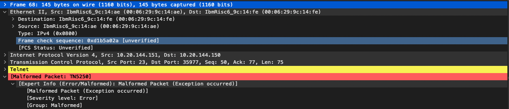

# compro-crc.cpap

## Question 1
Comment peut-on voit un CRC incorrect dans Wireshark ?

> Dans ce fichier il y a seulement une erreur mais le FCS *(Frame Check Sequence)* n'est pas vérifié donc comment savoir ?
> 
> 

## Question 1
Comment peut-on voit un CRC incorrect dans Wireshark ?

# nb6-telephone.pcap

## Question 1 
Identifier les champs

> Qu'elles champs ???

## Question 2
Est-ce que la valeur du type est correcte ?

> Qu'elle valeur ???

# http.cap

## Question 1 
Identifier les champs

> Qu'elles champs ???

## Question 2
Est-ce que la valeur du type est correcte ?

> Qu'elle valeur ???
