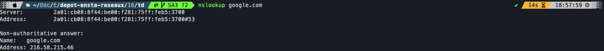
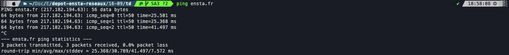
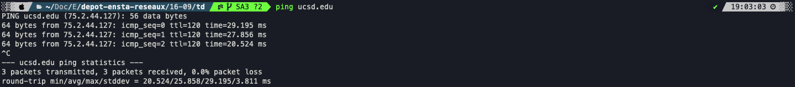
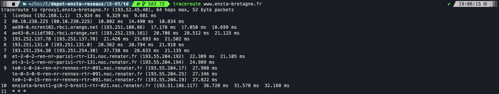
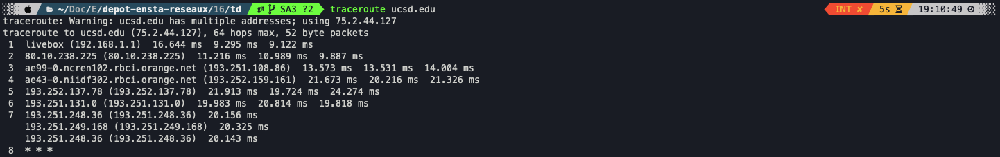
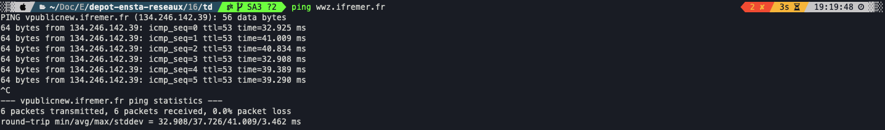
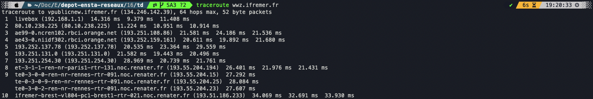
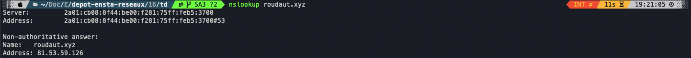
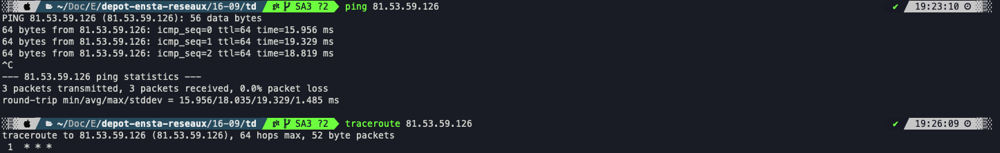
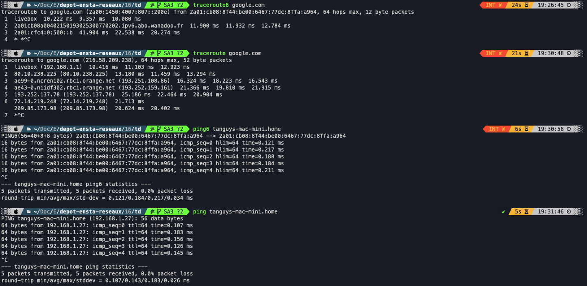

# TD2 - Commandes de base Linux et ~~Windows~~ Linux

## 1 - Commandes sous Linux

### **Question 1 -** Trouvez comment avoir plus d'information qu'avec ```ifconfig```
> On peut utiliser ```ifconfig -v```
>
> *The -v flag may be used to get more verbose status for an interface.*

### **Question 2 -** Que renvoie les commandes nslookup et arp
> ```arp -a``` retourne les machines qui sont sur le mêne réseau que nous avec leurs adresse IP et MAC

> ```nslookup``` permet d'obtenir une @IP à partir d'un DNS :
>
> 

### **Question 4 -** Lancez un navigateur, affichez ce site, et pinguez le serveur web de l'ENSTA [ensta.fr](ensta.fr), observez le temps de transfert.
> 

### **Question 5 -** Toujours depuis l'Allemagne, pinguez un serveur de l'ouest des USA l'université de San-Diego en Californie : [ucsd.edu](ucsd.edu), observez le temps de transfert. Que pouvez-vous déduire de ces quelques valeurs de temps de transfert ?
> 

### **Question 6 -** Traceroutez la machine [www.ensta-bretagne.fr](www.ensta-bretagne.fr) et observez le chemin emprunté.
> 

### **Question 7 -** Traceroutez la machine [ucsd.edu](ucsd.edu) et constatez le franchissement de l'Atlantique..
> 

### **Question 8 -** Vous pouvez aussi tester vers [www.ifremer.fr](www.ifremer.fr). Que constatez-vous ?
> 

> 

### **Question 9 -** Vous pouvez aussi trouver votre adresse IP. Que constatez-vous ?
> 

### **Question 10 -** Tentez de pinguer et tracerouter votre propre IP. Que constatez-vous ?
> 

### **Question 11 -** Globalement que pensez-vous des résultats IPv6 ?
> 
