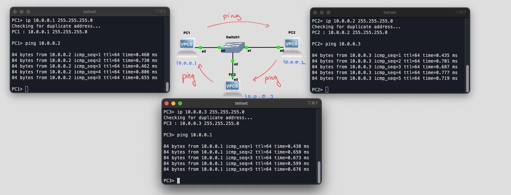
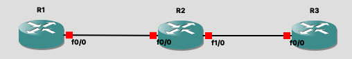
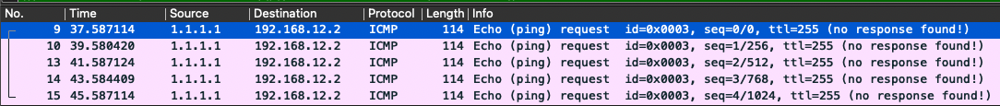

# TP / TD sur GNS3

## Manipulation 1

| icone                  | utilité                                        |
| ---------------------- | ---------------------------------------------- |
|    | Menu pour l'ajout d'un *VPCS*                  |
|  | Menu pour l'ajout d'un *Switch*                |
|    | Pour câblé les différents périphériques        |
|   | Pour afficher les noms des ports de connexions |
|     | Pour executer le programme                     |
|    | Pour ouvrir les terminals                      |





1. Adressage d'une @ip avec `ip`:
   - *Arg1 :* @ip
   - *Arg2 :* Le mask
2. On peut `ping` les 3 pc ensembles puisqu'ils sont sur le même réseau


## Manipulation 2

*Pour le modèle de routeur C7200 à sélectionner, préférez celui-ci : https://tfr.org/cisco-ios/7200/c7200-jk9s-mz.124-13b.bin*

| icone                   | utilité                        |
| ----------------------- | ------------------------------ |
|  | Menu pour l'ajout d'un routeur |



Pour ajouter une interface au routeur :

> Clic droit &rarr; *Configuration* &rarr; *slot* &rarr; ajout d'un slot de type *FE*


Après avoir éxecuter et ouvert les terminaux, on peut configurer les routeurs avec en ligne de commandes grâce au système d'exploitation du routeur. Le système d'exploitation des routeur *CISCO* se nomme *CISCO IOS*, les commandes qui seront utilisé dans cette manip seront donc probablement applicable uniquement sur *CISCO IOS* et pas d'autres OS.

- Quelques commandes de bases :

  1. Pour entrer en utilisateur `root` il faut utiliser la commande `enable`

  2. `configure terminal` permet de configurer le routeur en mode `root` et d'accéder au sous-modes de configuration (interface, processus de routage, classes ou politiques de QoS, etc...)

#### Question 1

A partir de l'exemple de la *figure 2*, affecter les adresse IP indiquées dans la *figure 1* aux interfaces des routeurs.

> ```
> R1#configure terminal
> Enter configuration commands, one per line.  End with CNTL/Z.
> R1(config)#interface fastEthernet 0/0
> R1(config-if)#ip address 192.168.12.1 255.255.255.0
> R1(config-if)#no shutdown
> R1(config-if)#
> *Oct 25 20:19:47.447: %LINK-3-UPDOWN: Interface FastEthernet0/0, changed state to up
> R1(config-if)#
> *Oct 25 20:19:47.447: %ENTITY_ALARM-6-INFO: CLEAR INFO Fa0/0 Physical Port Administrative State Down
> *Oct 25 20:19:48.447: %LINEPROTO-5-UPDOWN: Line protocol on Interface FastEthernet0/0, changed state to up
> R1(config-if)#exit
> R1(config)#exit
> R1#
> *Oct 25 20:19:53.419: %SYS-5-CONFIG_I: Configured from console by console
> R1#
> ```
>
> ```
> R2#configure terminal
> Enter configuration commands, one per line.  End with CNTL/Z.
> R2(config)#interface fastEthernet 0/0
> R2(config-if)#ip address 192.168.12.2 255.255.255.0
> R2(config-if)#no shutdown
> R2(config-if)#
> *Oct 25 20:20:49.199: %LINK-3-UPDOWN: Interface FastEthernet0/0, changed state to up
> R2(config-if)#
> *Oct 25 20:20:49.199: %ENTITY_ALARM-6-INFO: CLEAR INFO Fa0/0 Physical Port Administrative State Down
> *Oct 25 20:20:50.199: %LINEPROTO-5-UPDOWN: Line protocol on Interface FastEthernet0/0, changed state to up
> R2(config-if)#exit
> R2(config)#interface fastEthernet 1/0
> R2(config-if)#ip address 192.168.23.2 255.255.255.0
> R2(config-if)#no shutdown
> R2(config-if)#
> *Oct 25 20:21:49.623: %LINK-3-UPDOWN: Interface FastEthernet1/0, changed state to up
> R2(config-if)#
> *Oct 25 20:21:49.623: %ENTITY_ALARM-6-INFO: CLEAR INFO Fa1/0 Physical Port Administrative State Down
> *Oct 25 20:21:50.623: %LINEPROTO-5-UPDOWN: Line protocol on Interface FastEthernet1/0, changed state to up
> R2(config-if)#exit
> R2(config)#exit
> R2#
> *Oct 25 20:21:57.291: %SYS-5-CONFIG_I: Configured from console by console
> R2#
> ```
>
> ```
> R3#configure terminal
> Enter configuration commands, one per line.  End with CNTL/Z.
> R3(config)#interface fastEthernet 0/0
> R3(config-if)#ip address 192.168.23.1 255.255.255.0
> R3(config-if)#no shutdown
> R3(config-if)#
> *Oct 25 20:22:50.987: %LINK-3-UPDOWN: Interface FastEthernet0/0, changed state to up
> R3(config-if)#
> *Oct 25 20:22:50.987: %ENTITY_ALARM-6-INFO: CLEAR INFO Fa0/0 Physical Port Administrative State Down
> *Oct 25 20:22:51.987: %LINEPROTO-5-UPDOWN: Line protocol on Interface FastEthernet0/0, changed state to up
> R3(config-if)#exit
> R3(config)#exit
> R3#
> *Oct 25 20:22:57.483: %SYS-5-CONFIG_I: Configured from console by console
> R3#
> ```


#### Question 2

Testez que R1 peut pinger R2, et R2 peut pinger R3 :

> ```
> R1#ping 192.168.12.2
> 
> Type escape sequence to abort.
> Sending 5, 100-byte ICMP Echos to 192.168.12.2, timeout is 2 seconds:
> .!!!!
> Success rate is 80 percent (4/5), round-trip min/avg/max = 12/47/108 ms
> ```
>
> ```
> R2#ping 192.168.23.1
> 
> Type escape sequence to abort.
> Sending 5, 100-byte ICMP Echos to 192.168.23.1, timeout is 2 seconds:
> !!!!!
> Success rate is 100 percent (5/5), round-trip min/avg/max = 12/18/32 ms
> ```


#### Question 3

En mode privileged, visualisez :

1. la configuration détaillée des interfaces : `router# show interfaces`

2. la configuration IP résumée de toutes les interfaces : `router# show interfaces brief` 

3. la table de routage : `router# show ip route` 

> ```
> R2#show interfaces
> FastEthernet0/0 is up, line protocol is up
>   Hardware is DEC21140, address is ca02.06b2.0000 (bia ca02.06b2.0000)
>   Internet address is 192.168.12.2/24
>   MTU 1500 bytes, BW 100000 Kbit, DLY 100 usec,
>      reliability 255/255, txload 1/255, rxload 1/255
>   Encapsulation ARPA, loopback not set
>   Keepalive set (10 sec)
>   Half-duplex, 100Mb/s, 100BaseTX/FX
>   ARP type: ARPA, ARP Timeout 04:00:00
>   Last input 00:00:01, output 00:00:01, output hang never
>   Last clearing of "show interface" counters never
>   Input queue: 0/75/0/0 (size/max/drops/flushes); Total output drops: 0
>   Queueing strategy: fifo
>   Output queue: 0/40 (size/max)
>   5 minute input rate 0 bits/sec, 0 packets/sec
>   5 minute output rate 0 bits/sec, 0 packets/sec
>      17 packets input, 4311 bytes
>      Received 13 broadcasts, 0 runts, 0 giants, 0 throttles
>      0 input errors, 0 CRC, 0 frame, 0 overrun, 0 ignored
>      0 watchdog
>      0 input packets with dribble condition detected
>      81 packets output, 8797 bytes, 0 underruns
>      0 output errors, 0 collisions, 1 interface resets
> ```

> ```
> R2#show ip route
> Codes: C - connected, S - static, R - RIP, M - mobile, B - BGP
>        D - EIGRP, EX - EIGRP external, O - OSPF, IA - OSPF inter area
>        N1 - OSPF NSSA external type 1, N2 - OSPF NSSA external type 2
>        E1 - OSPF external type 1, E2 - OSPF external type 2
>        i - IS-IS, su - IS-IS summary, L1 - IS-IS level-1, L2 - IS-IS level-2
>        ia - IS-IS inter area, * - candidate default, U - per-user static route
>        o - ODR, P - periodic downloaded static route
> 
> Gateway of last resort is not set
> 
> C    192.168.12.0/24 is directly connected, FastEthernet0/0
> C    192.168.23.0/24 is directly connected, FastEthernet1/0
> ```


#### Question 4

On va maintenant créer des interfaces de loopback (bouclage en français) à chacun de ces routeurs. Sur un routeur, on peut créer plusieurs interfaces de loopback, qui sont simplement des interfaces virtuelles, présentes dans la pile TCP/IP à la couche 3, mais pas aux couches 2 et 1. Un routeur voit cette interface directement connectée dans la table de routage, comme ses autres interfaces physiques. Elle est donc accessible par les interfaces physiques, et peut générer des paquets IP routés à travers les interfaces physiques. Les interfaces de loopback sont utilisées pour joindre le routeur pour management, soit par l'administrat·rice·eur soit par protocole de routage (ou pour simuler l'existence de réseaux). Pour chaque routeur N, créez une interface de loopback et a􏰀ectez-y l'adresse N.N.N.N/32.

> ```
> R1#configure terminal
> Enter configuration commands, one per line.  End with CNTL/Z.
> R1(config)#interface loopback 0
> R1(config-if)#
> *Oct 25 20:52:46.471: %LINEPROTO-5-UPDOWN: Line protocol on Interface Loopback0, changed state to up
> R1(config-if)#ip address 1.1.1.1 255.255.0.0
> ```
>
> ```
> R2#configure terminal
> Enter configuration commands, one per line.  End with CNTL/Z.
> R2(config)#interface loopback 0
> R2(config-if)#
> *Oct 25 20:56:55.467: %LINEPROTO-5-UPDOWN: Line protocol on Interface Loopback0, changed state to up
> R2(config-if)#ip address 2.2.2.2 255.255.0.0
> ```
>
> ```
> R3#configure terminal
> Enter configuration commands, one per line.  End with CNTL/Z.
> R3(config)#interface loopback 0
> R3(config-if)#
> *Oct 25 20:57:53.767: %LINEPROTO-5-UPDOWN: Line protocol on Interface Loopback0, changed state to up
> R3(config-if)#ip address 3.3.3.3 255.255.0.0
> ```


#### Question 5

Visualisez la table de routage et indiquez son contenu résumé.

>```
>R1#show ip route
>Codes: C - connected, S - static, R - RIP, M - mobile, B - BGP
>       D - EIGRP, EX - EIGRP external, O - OSPF, IA - OSPF inter area
>       N1 - OSPF NSSA external type 1, N2 - OSPF NSSA external type 2
>       E1 - OSPF external type 1, E2 - OSPF external type 2
>       i - IS-IS, su - IS-IS summary, L1 - IS-IS level-1, L2 - IS-IS level-2
>       ia - IS-IS inter area, * - candidate default, U - per-user static route
>       o - ODR, P - periodic downloaded static route
>
>Gateway of last resort is not set
>
>C    192.168.12.0/24 is directly connected, FastEthernet0/0
>     1.0.0.0/16 is subnetted, 1 subnets
>C       1.1.0.0 is directly connected, Loopback0
>```
>
>Le routeur 1 est connecté au réseau  `192.168.12.0/24` et à la loopback `1.1.0.0`

> ```
> R2#show ip route
> Codes: C - connected, S - static, R - RIP, M - mobile, B - BGP
>        D - EIGRP, EX - EIGRP external, O - OSPF, IA - OSPF inter area
>        N1 - OSPF NSSA external type 1, N2 - OSPF NSSA external type 2
>        E1 - OSPF external type 1, E2 - OSPF external type 2
>        i - IS-IS, su - IS-IS summary, L1 - IS-IS level-1, L2 - IS-IS level-2
>        ia - IS-IS inter area, * - candidate default, U - per-user static route
>        o - ODR, P - periodic downloaded static route
> 
> Gateway of last resort is not set
> 
> C    192.168.12.0/24 is directly connected, FastEthernet0/0
>      2.0.0.0/16 is subnetted, 1 subnets
> C       2.2.0.0 is directly connected, Loopback0
> C    192.168.23.0/24 is directly connected, FastEthernet1/0
> ```
>
> Le routeur 2 est connecté aux réseaux  `192.168.12.0/24`, `192.168.23.0/24`  et à la loopback `2.2.0.0`

> ```
> R3#show ip route
> Codes: C - connected, S - static, R - RIP, M - mobile, B - BGP
>        D - EIGRP, EX - EIGRP external, O - OSPF, IA - OSPF inter area
>        N1 - OSPF NSSA external type 1, N2 - OSPF NSSA external type 2
>        E1 - OSPF external type 1, E2 - OSPF external type 2
>        i - IS-IS, su - IS-IS summary, L1 - IS-IS level-1, L2 - IS-IS level-2
>        ia - IS-IS inter area, * - candidate default, U - per-user static route
>        o - ODR, P - periodic downloaded static route
> 
> Gateway of last resort is not set
> 
>      3.0.0.0/16 is subnetted, 1 subnets
> C       3.3.0.0 is directly connected, Loopback0
> C    192.168.23.0/24 is directly connected, FastEthernet0/0
> ```
>
> Le routeur 3 est connecté au réseau  `192.168.23.0/24` et à la loopback `3.3.0.0`


#### Question 6

Que signifie C devant les différentes routes de la table de routage ? Y a t-il d'autres possibilités que C, et à quoi correspondent-elles ?

> C &rarr; Connected
>
> Les autres possibilité sont :
>
> ```
> Codes: C - connected, S - static, R - RIP, M - mobile, B - BGP
>        D - EIGRP, EX - EIGRP external, O - OSPF, IA - OSPF inter area
>        N1 - OSPF NSSA external type 1, N2 - OSPF NSSA external type 2
>        E1 - OSPF external type 1, E2 - OSPF external type 2
>        i - IS-IS, su - IS-IS summary, L1 - IS-IS level-1, L2 - IS-IS level-2
>        ia - IS-IS inter area, * - candidate default, U - per-user static route
>        o - ODR, P - periodic downloaded static route
> ```


#### Question 7

Tester un ping depuis f0/0 de R1 vers f0/0 de R2 

> ```
> R1#ping 192.168.12.2 source fastethernet 0/0
> 
> Type escape sequence to abort.
> Sending 5, 100-byte ICMP Echos to 192.168.12.2, timeout is 2 seconds:
> Packet sent with a source address of 192.168.12.1
> !!!!!
> Success rate is 100 percent (5/5), round-trip min/avg/max = 12/29/56 ms
> ```


#### Question 8

Tester ensuite un ping depuis loopback 0 de R1 vers f0/0 de R2, est-ce un succès ? Pourquoi ?

> ```
> R1#ping 192.168.12.2 source loopback 0
> 
> Type escape sequence to abort.
> Sending 5, 100-byte ICMP Echos to 192.168.12.2, timeout is 2 seconds:
> Packet sent with a source address of 1.1.1.1
> .....
> Success rate is 0 percent (0/5)
> ```
>
> C'est une loopback l'interface est connecté *(sortie et entré)* sur le routeur 1, c'est l'équivalent de l'@IP `127.0.0.1`. Métaphoriquement ont peut voir ça comme un court-circuit.
>
> De plus, on voit bien sur la table de routage que le routeur 2 n'est pas connecté au réseau `1.1.0.0`, donc il ne peut pas répondre.


#### Question 9

On va maintenant réaliser une capture Wireshark :

1. Repérez le répertoire dans lequel vont être stockés les fichiers de capture : edit &rarr;  preferences &rarr; captures
2. Bouton droit sur le lien entre R1 et R2, puis capturer, de même entre R2 et R3
3. Faîtes le ping ci-dessus
4. A droite de la fenêtre GNS3 sur les captures, bouton droit puis toutes les arrêter
5. Ouvrez ensuite ces captures dans Wireshark et repérez les paquets dus au ping

> Obtenu pour la capture entre le routeur 1 et le routeur 2:
>
> 
>
> Entre le routeur 2 et 3, il n'y a aucune trace du `ping`


## Routage RIP

### Routage Statique

#### Question 10

Installer les équipements (routeurs et terminaux) comme illustré dans la figure 3. Le câblage entre les di􏰀érents noeuds se fait en utilisant les interfaces Ethernet.


