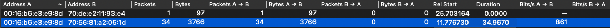

# Wifi - Exercice 2 - L'exercice se base sur la capture Wireshark trace-80211.pcap

> Pascal Cotret, [ENSTA Bretagne](mailto:pascal.cotret@ensta-bretagne.fr) - FIPA24

## Inspection d'une trace

### Question 1

Paquet #16. Record **Frame**

- A quelle date est arrivée le paquet ?
  
  > 

- Que peut-on dire de cet ensemble d'informations par rapport au protocole WiFi ?

  > 
  > - La taille du paquet est de 1539 octets
  > - Le paquet consiste à transférer des données 

### Question 2

Paquet #16. Record **IEEE 802.11**, champ **Frame Control**.

- Vérifier que le type et le sous-type sont conformes aux spécifications.
  
  > 
  > 
  >
  > Le type *2* et le sous-type *0* est alors conformes aux spécifications pour un transfert de données. 

### Question 3

Paquet #16. Record **IEEE 802.11**.

- S'agit-il d'un dernier fragment ?
  > 
  >
  > Il s'agit bien d'un dernier fragment

- Est-ce que celui-ci est protégé ?
  > 
  >
  > Les données de ce fragment sont protégés

## Couche physique du 802.11

### Question 4

Paquet #16. Quelle est la fréquence du signal ?
> 
>
> La fréquence du signal est de 2462MHz

### Question 5

Ajouter une colonne dans Wireshark pour visualiser le RSSI (*Received Signal Strength Indication*). Quelles sont les différentes valeurs de RSSI que l'on peut observer ?
> - On constate dans un premier temps que la Frame#16 est à -67dBm
> 
> 
>
> - Puis que les valeurs vont de -69dBm à -44dBm
>
> 
>
> 

## Couche liaison

Menu `Statistics` => `Conversations` => `Conversation Types` et sélectionner 802.11.

### Question 6

Combien de paquets ont été transmis entre `00:16:b6:e3:e9:8d` et `70:56:81:a2:05:1d` ? Combien d'octets ?
> 
>
> 34 paquets on été transmis entre `00:16:b6:e3:e9:8d` et `70:56:81:a2:05:1d` pour un total de 3766 octets

### Question 7

Dans la capture, combien y a-t-il de paquet de type `Data` ?
> On utilise le filtre `wlan.fc.type_subtype == Data` pour trouver qu'il y a 3731 paquet dans la capture

# 
