# DS Réseau - Tanguy ROUDAUT

## Exercice 1 - Analyse de trames réseaux

1. Quelle est l’adresse IP de la machine A ?

   > @IP source: `10.0.2.15`

   

2. D’après la trace réseau, comment la machine A a-t-elle obtenu cette adresse IP ?

   > La machine A, a obtenus sont @IP grâce à des requettes avec un serveur DHCP
   >
   > #1 &rarr; #4

   

3. À quoi correspond l’adresse IP 255.255.255.255 ? Pourquoi est-elle utilisée dans cette trace réseau ?

   > C'est le broadcast, quand on va réaliser un ping ou un tranfert de paquet sur l'@Broadcast, tout le monde peut recevoir les paquets. Ici c'est un serveur DHCP,  il doit donc interroger le serveur DHCP, on peut utiliser l'@Broadcast si on ne connait pas l'@ du serveur

   

4. L’adresse MAC 52:54:00:12:35:02 est elle l’adresse de la machine A, du commutateur S, du routeur R ou du serveur de Google ? Pourquoi ?

   > L'@IP de destination associé à l'@MAC de destination `52:54:00:12:35:02` de la #9, est `172.217.19.227`.
   >
   > On remarque que la machine A, a obtenu l'@IPv4 du serveur google grâce au protocole DNS, dans la #7. Cette IP est  `172.217.19.227`, on peut donc conclure que l'@MAC  `52:54:00:12:35:02` correspond au serveur Google

   

5. Quelle est l’adresse IP du serveur de Google dans la trace ?

   > @IPv4 &rarr; `172.217.19.227`
   >
   > @IPv6 &rarr; #8

   

6.  Comment la machine A a-t-elle pu obtenir cette adresse IP?

   > Avec le protocole DNS
   >
   > Demande @IPv4 en #5, réponse en #7
   >
   > Demande @IPv6 en #6, réponse en #8

## Exercice 2 - Wifi 

7. Quels sont les différents points d’accès que vous pouvez identifier ? Quels sont les SSID des réseaux qu’ils annoncent ?

   >D'après le site de cisco, probe request signifie *"Probe request is sent by a station in order to “scan” for an SSID."* Donc avec le filtre `wlan.fc.type_subtype == 0x04`, on peut filtrer les scan de SSID :
   >
   >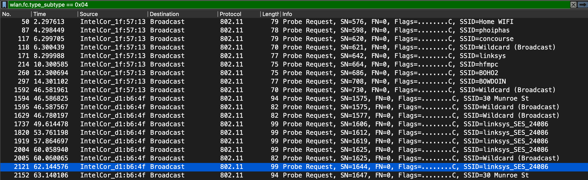
   >
   >Les SSID sont affichés dans le plus à droite sur l'image

   

8. Quelle est l’adresse MAC de destination des *beacon frames* ?

   >  Pour filtrer le sous-type *Beacon*, il faut utiliser le filtre `wlan.fc.type_subtype == 0x08` :
   >
   > 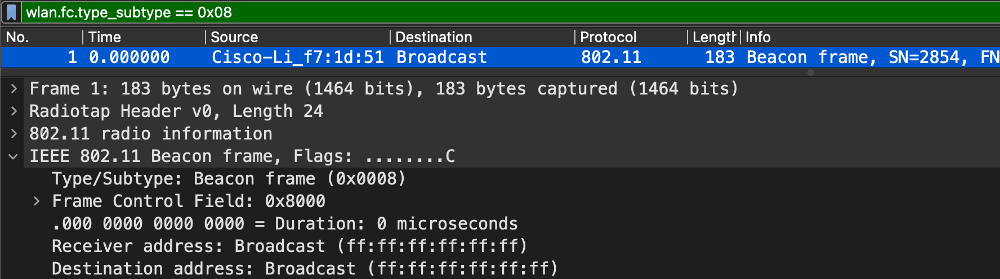
   >
   > Par exemple ici pour la #1, la destination est le *Broadcast* donc l'@MAC de destination est `ff:ff:ff:ff:ff:ff`.
   >
   > C'est la même choses pour toutes les autres frames, l'@ de destination est toujours le Broadcast

   

9. Quel est l’intervalle d’émission de ces *beacon frames* ?

   > 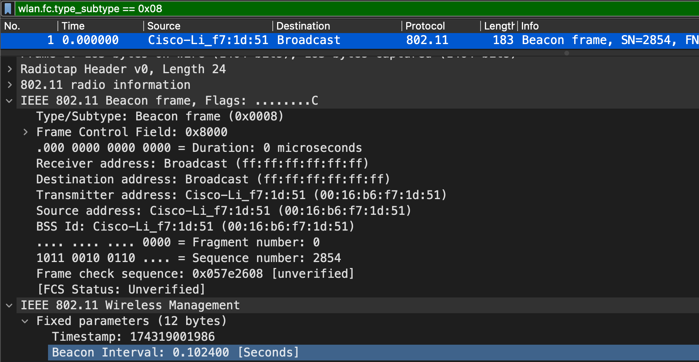
   >
   > L'intervalle d'émission des beacon frames est de *0.1024*, c'est valable pour #1 mais également pour les autres.

   

10. Quels sont les débits supportés par le point d’accès *30 Munroe St* ?

    > 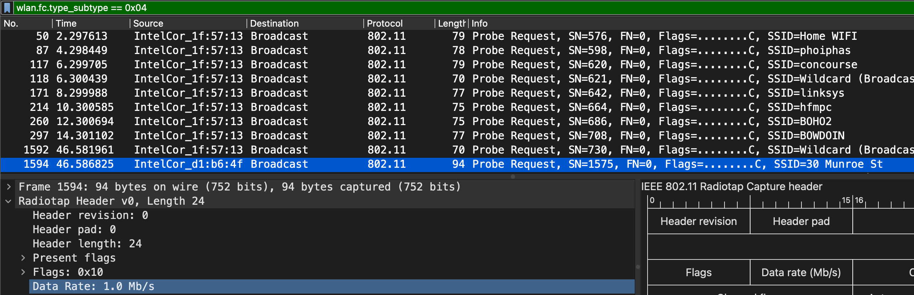
    >
    > Le débit supporté est de 1.0 Mb/s

    

11.  Le paquet n° 474 correspond à une demande de connexion TCP (SYN) effectuée par une machine déjà associée à l’un des points d’accès. Que désignent les trois addresses MAC de cette trame ? À quelles interfaces réseau correspondent-elles ?

    > 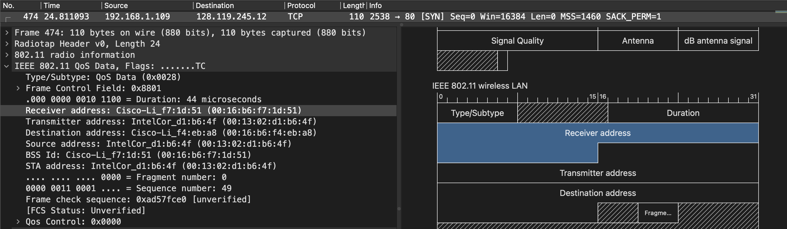
    >
    > @receiver &rarr; `00:16:b6:f7:1d:51` &rarr; @MAC du destinataire
    >
    > @transmitter &rarr; `00:13:02:d1:b6:4f`  &rarr; @MAC de l'émetteur 
    >
    > @destination &rarr; `00:16:b6:f4:eb:a8`  &rarr; @MAC du routeur de destination
    >
    > Elles appartiennent à l'interface WLAN pour un transfert de donnée 

    

12. Quelles sont les adresses IP source et destination de cette trame ? A quels nœuds du réseau correspondent ces adresses ?

    > @IP src : `192.168.1.109` &rarr; Utilisateur connecté sur le réseau à un routeur
    >
    > @IP dst : `128.119.245.12` &rarr; Serveur distant hors du réseau [https://gaia.cs.umass.edu](https://gaia.cs.umass.edu/)

    

13. Ce paquet a-t-il bien été reçu par le point d’accès ?

    > Oui réponse de la #474 à la #476 :
    >
    > 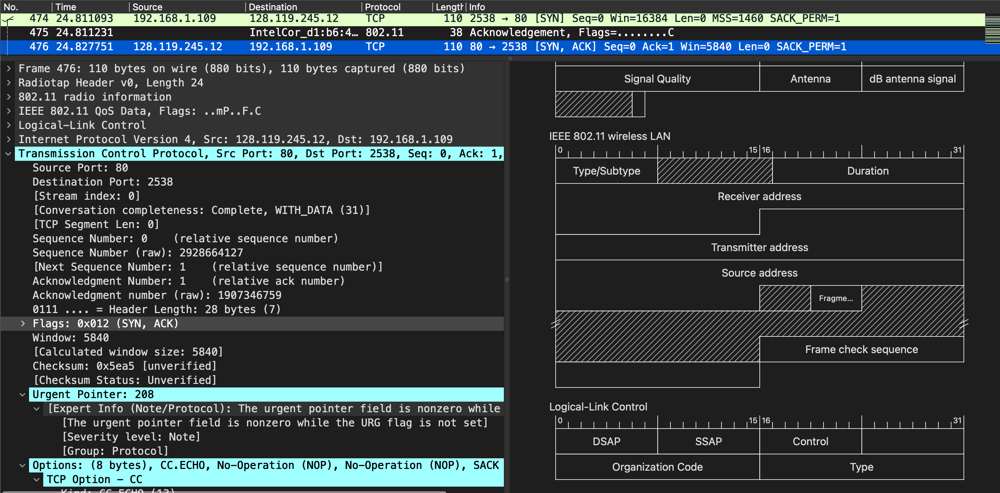

    

14. Identifiez les demandes d’authentification. Vous pouvez pour cela utiliser le filtre d’affichage de Wireshark `wlan.fc.type_subtype == 0x000b`. Sur quel point d’accès la machine `00:13:02:d1:b6:4f` tente-t-elle d’abord de s’authentifier ? Quel type d’authentifi- cation tente-t-elle de réaliser ? Est-ce que le point d’accès lui répond ?

    > 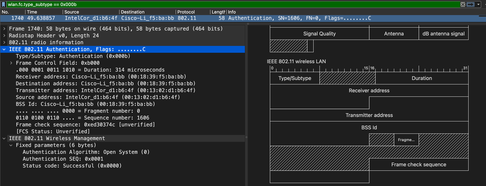
    >
    > Elle essaie de s'autentifier à la machine `Cisco-Li_f5:ba:bb` avec l'@MAC `00:18:39:f5:ba:bb`
    >
    > Elle essaie de réaliser une authentification ouverte, c'est à dire sans mot de passe.
    >
    > Le point d'accès ne lui a jamais répondu

    

15. Sur quel autre point d’accès la machine tente-t-elle ensuite de s’authentifier ? Quelle est la réponse de ce point d’accès ?

    > 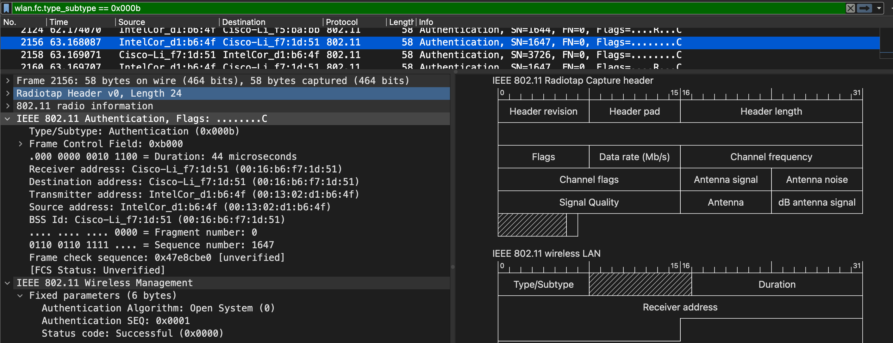
    >
    > Sur la machine  `Cisco-Li_f7:1d:51` avec l'@MAC `00:16:b6:f7:1d:51`

    > Le point d'accès lui a répondu avec succès  :
    >
    > 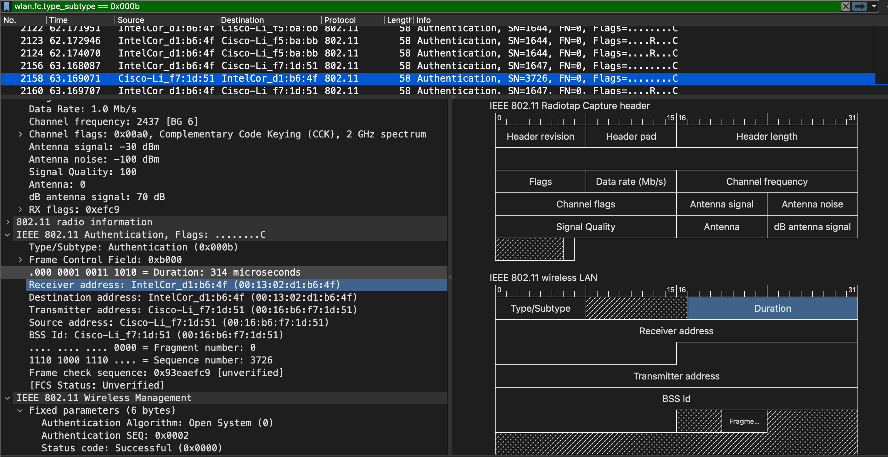

    

16. Quelles sont les trames d’association correspondant à cette dernière authentification ? Quels sont les débits supportés par la machine ? Quels sont ceux supportés par le point d’accès ?

    >Le débit de la machine est de 54Mb/s :
    >
    >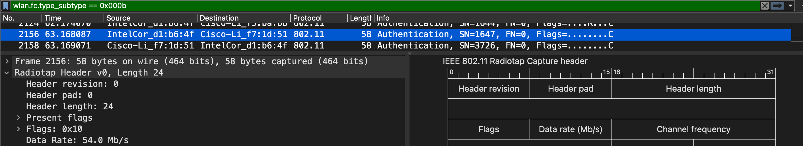

    > Le débit du point dàccès est de 1Mb/s:
    >
    > 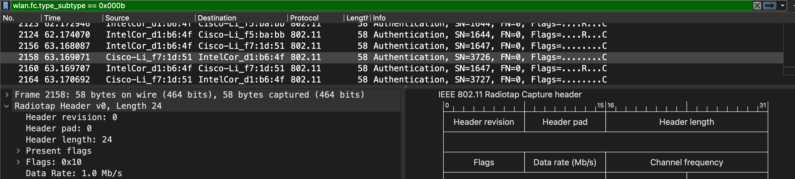

    

17. À quoi correspond le message n° 2152 ? Quels sont les noeuds qui répondent à ce message ? Quelle est leur réponse ?

    > C'est un *probe request*
    >
    > 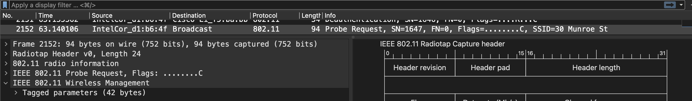
    >
    > Comme expliqué à la question 7, probe request signifie *"Probe request is sent by a station in order to “scan” for an SSID."*
    >
    > Les noeuds qui réponde à ce message c'est les routeurs
    >
    > On peut voir la réponse d'un *probre request* avec `wlan.fc.type_subtype == 0x05`

    

## Exercice - Analyse des trames d’un réseau local Ethernet

18. En observant les paquets 71 à 74, quel est le protocole de transport utilisé pour échanger ces différents messages ? Quelles sont les garanties offertes par ce protocole ?

    > 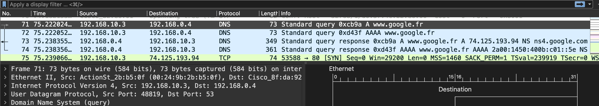
    >
    > Le protocole de transport est le UDP
    >
    > L'avantage de l'UDP est de pouvoir envoyer rapidement des information comme aucune connexion au destinataire est établie et qu'il n'y a pas de réponse attendue. L'inconvénient et que si il y a une erreur, on est pas au courant comme il n'y a pas de réponse.

    

19. Comment le destinataire du paquet n°78 peut-il identifier le protocole de transport utilisé ? Comment peut-il identifier le protocole applicatif ?

    > On remarque une partie identificiation dans le protocole IPv4 :
    >
    > 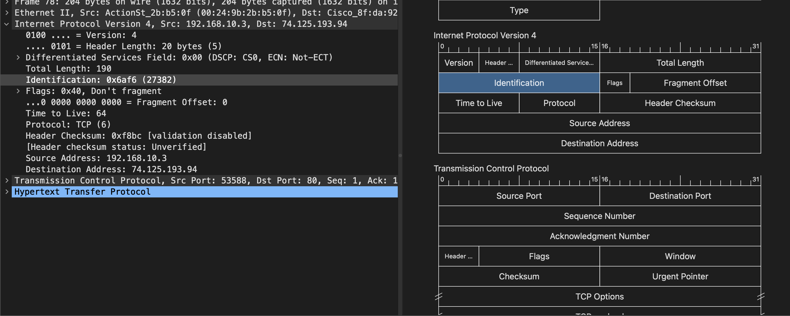

    

20. Quels sont les paquets qui établissent la connexion ? Ceux qui la terminent ? Expliquer le principe d’ouverture et de fermeture de connexion.

    

21. À quoi sert le paquet n°79 ?

    

18. Quels sont les ports source et destination des paquets n°78 et n°79 ? Pourquoi sont-ils inversés ? Comment ont-il été choisis par le client et le serveur ?

    >   #78 Port src &rarr; 53588
    >
    >   #78 Port dst &rarr; 80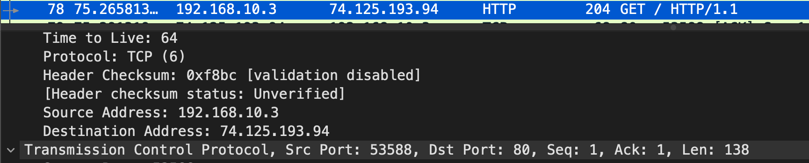

    > Pour le #79 ils sont inversé et c'est logique puisque l'échange se fait dans l'autre sens.

    

19. Quelle est l’adresse IP du routeur ?

    > L'@IP du routeur est `192.168.10.3`, on peut facilement s'en rendre compte avec la #71, le routeur utilise le protocole DNS pour obtenir l'@IPv4 du serveur google

    

20. Ouvrez maintenant le fichier `routeur.pcapng`. Quels sont les numéros des paquets qui correspondent aux messages évoqués dans les questions précédentes ? Est-ce que ces paquets sont identiques aux précédents (ont-il les mêmes adresses IP et MAC, source et destination ?) Pourquoi ?

    

21. À partir des messages de la trace, peut-on déterminer l’adresse MAC du serveur de Google ? Pourquoi ?

 

