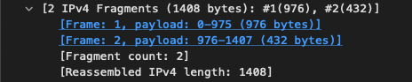
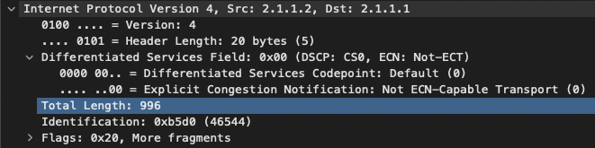
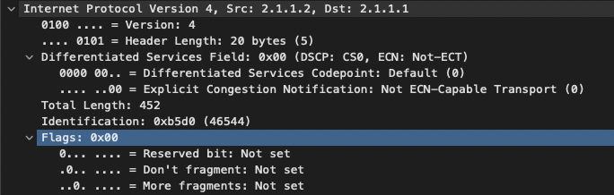

# Exercice page 26

## Question 1
Combien de fragments ?
> 
>
> Il y a deux fragment, le premier #1 rassemblé avec le #2

## Question 2
Quelle est la taille du MTU ?

## Question 3
Quelles sont les valeurs des flags des premier et dernier fragments ?
> Premier fragment, flags *0x20*, pour plus de fragments, soit celui en #2
> 
> 
>
> Dernier fragment, flags *0x00*, pour ne plus attendre de fragments
> 
> 

# Calcul d'adresse IP

```
ipcalc <ip>
```

Adresse IP | Classe | Partie réseau | Partie hôte | Masque
---|---|---|---|---
191.10.8.3 | B | 191.10.8.0/24 | 191.10.8.3 | 255.255.255.0
126.200.1.4 | A | 126.200.1.0/24 | 126.200.1.4 | 255.255.255.0
223.1.2.3 | C | 223.1.2.0/24 | 223.1.2.3 | 255.255.255.0
240.37.42.57 | E | 240.37.42.0/24 | 240.37.42.57 | 255.255.255.0

