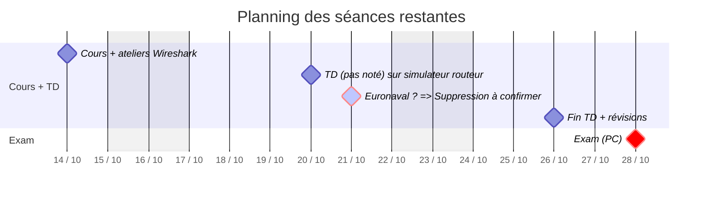

# Cours de réseaux - FIPA 24

Dans la mesure du possible, les supports de cours, exercices et documents annexes seront mis sous Moodle et, en priorité sur Gitlab, dans la journée après le cours.

## Installation de Wireshark sur les laptop ENSTA-B

```bash
sudo add-apt-repository ppa:wireshark-dev/stable
sudo apt update
sudo apt install wireshark
```

## Planning des séances restantes


